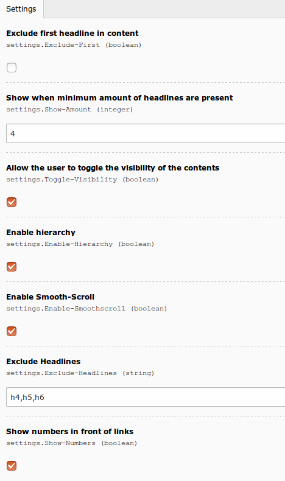

.. ==================================================
.. FOR YOUR INFORMATION
.. --------------------------------------------------
.. -*- coding: utf-8 -*- with BOM.

.. include:: ../Includes.txt

.. _admin-manual:

Administrator Manual
====================

Install within the extension manager, edit settings if you wish.

Target group: **Administrators**

Installation
------------

To install the extension, perform the following steps:

#. Go to the Extension Manager
#. Install the extension
#. Load the static template

	Settings (caption of the image)

