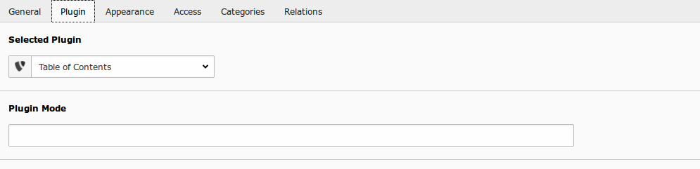

.. ==================================================
.. FOR YOUR INFORMATION
.. --------------------------------------------------
.. -*- coding: utf-8 -*- with BOM.

.. include:: ../Includes.txt

.. _users-manual:

Users manual
============

One may insert the plugin within a content page. Choose "Insert Content", then "Generic Plugin", afterwards the "Table of Contents" will be available at the Plugin Tab. Save the new content element and take a look at the frontend to see the table of contents.

Target group: **Users**

	Default Backend view

