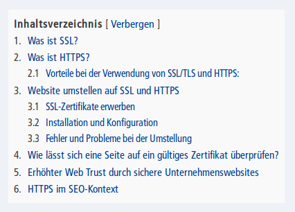

# toc
table of contents (TOC) for typo3

Enables a Table of Contents know from Websites like Wikipedia as a plugin for each page which has headlines.

This plugin generates a table of contents (TOC) for a content page by using the headlines, which are identified by h1, h2, h3, h4, h5 or h6. There is the possibility to change the output within the settings.
